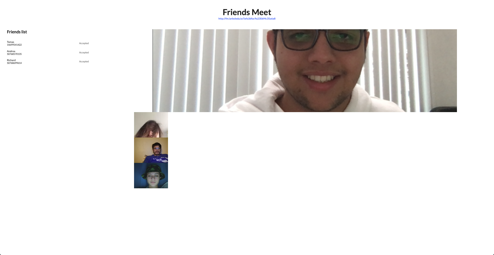
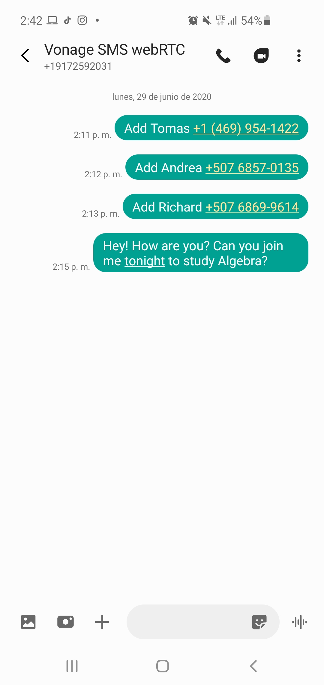
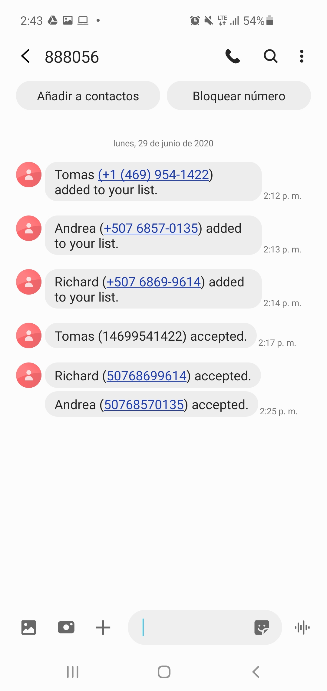
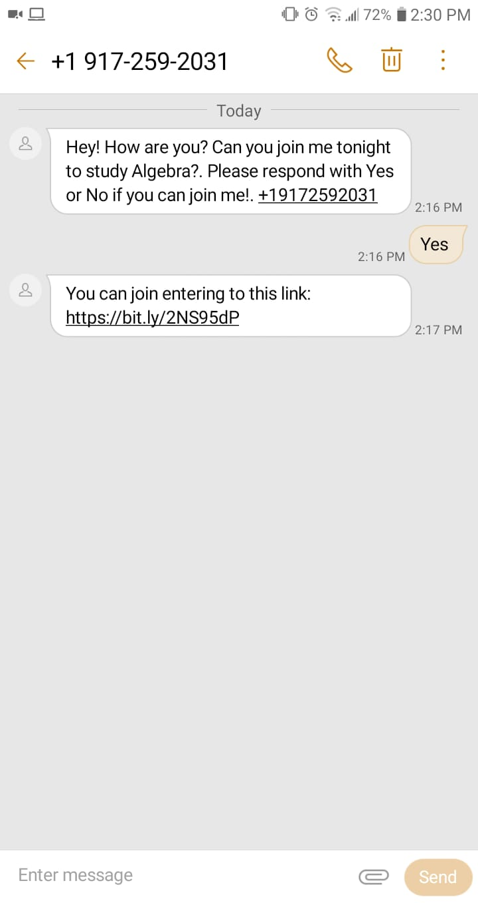

# Friends Meet

As part of the [webRTC.ventures](http://webrtc.ventures) job application, I have developed a web application based on the coding challenge requirements provided:
1. Use Vonage/Nexmo virtual phone number for SMS messages interaction.
2. Receive and parse a "join me" message to start a poll and set a meeting.
3. Forward SMS messages to host's friends phone numbers appending "Please respond with Yes or No if you can join me!". If he accept, send back an SMS message with a video meeting link.
4. Send back to host's phone number if his friend accepted or declined the meeting request.
5. Create a video room for each meeting using Vonage Video API.

# Overview
Friends meet is a web application focused on SMS messages interaction for manage friends list, set video-call meetings with them, and visualize their assistance. It allows you to manage your group of friends' phone numbers, make a poll to establish a video-call conference, and see who can join you or not. Only have to send an SMS message to +1 (917) 259-2031 with a pre-formatted text command to start using it.

**Create a group and add a friend**  
Send an SMS message with the format `Add <name> <phone>` where name it's the name of your friend and phone it's the phone number of your friend in any international format (including country code) to create your group (if you haven't) and add your friend's phone number to it.

**Create a meeting poll **  
Send an SMS message containing `join me` (case insensitive) to create a meeting request. This message it's sent to your friends as it is received, and the instructions to respond are included.

**Answer a poll request **  
Send an SMS message with `Yes` or `No` to accept or decline the meeting request. If you accept it, you will receive an invitation link to the video-call conference. Your answer it's sent back to the meeting's host.

With this service and it's simple commands, people can avoid to enter to a webpage to manage meetings. They can do it all on a familiar application, sending the same messages that they send daily. So, it can increase adoption and engagement.

## Application Screenshots
  

Video-call meeting

  

Friends management

  

Meeting poll

  

Friend meeting request

---

# Technical specifications
Friends meet was developed using Node.js with hapi.js framework because it's robust, scalable, secure, and enterprise-solution proved, following the MVC pattern to separate view related things, e.g., validation, business logic, and the data layer.

## Components
- **Node.js API application**
    API to receive and parse SMS web-hooks, manage meetings and friends groups, and generate video-meeting tokens. It's main responsibility are:
    - Parse and handle SMS web-hooks.
    - Send SMS to host and friends.
    - Manage friends groups and meetings.
    - Manage video-meeting sessions.
    - Generate tokens for video-meeting's sessions.
- **React.js front-end**
    Front-end to allow users' video-meetings. It handles user's microphone and camera, and connects to Vonage / OpenTok to send and receive streaming data.
- **Vonage / Nexmo**
    Service to manage virtual phone numbers, and send and receive SMS messages. It receives SMS messages and send them to API web-hook, and send SMS requested by API to users.
- **Vonage / OpenTok**
    Service to manage video-meetings. It create video sessions, generate tokens for users, and handles all streaming related things to allow user's video-meetings.
- **Bitly**
    Service to short URLs. It short all meeting's url to free characters on limited SMS messages.

## Tests
I developed Unit Tests to check API's robustness. It mainly checks routes validations and errors' thrown.  
Firstly, I had an **89%** test coverage, but at the time that I was adding other components, it requires more time to develop them. So, I commented all integration tests and left only routes validation tests. Now, I have an 67% test coverage, and I think it's a good percentage for not including integration tests.

## Deployment
All components are deployed on AWS and reachable through [https://fm.larboleda.io](https://fm.larboleda.io) for front-end, [https://fmapi.larboleda.io](https://fmapi.larboleda.io) for API, and mongoldb://3.15.26.142:50000 for Mongo database.
API was deployed on an AWS Fargate service, mongoDB on an ec-2 machine and front-end on a S3 bucket and CDN distribution.

API and front-end are secured with a Letsencrypt free SSL certificate. With it, I can allow video-meetings because Google Chromes request SSL encryption to handle microphone and camera and avoid CORS problems. 

---

# Learnings and overcomes

**Documentation and support**  
Main of the libraries and services used are well-documented. However, Nexmo / Vonage has some points that are not clear and you have to research to solve them.
When I was developing the web-hooks endpoint, I wasn't clear about if Nexmo has it's own path and I only have to change the domain and API prefix or if it supports any endpoint that I set there.
Also, Nexmo support is not good enough because they takes a lot of time to answer queries and when they answer, probably it's not the final solution.
When I started to develop the SMS web-hook I requested to enable signature validation. Well, today I got an answer for it asking me to what project enable it.

I learned to integrate [Bit.ly](http://bit.ly) and OpenTok services. Bit.ly has a well documented API and a supported package for Node.js. OpenTok also has a well documented API and very understandable processionals diagram.
Also, I learned to generate a free SSL certificate with Letsencrypt. I have done it before, but with AWS ACM.

**Exposed API key and API secret**  
When I was integrating Nexmo / Vonage, I pushed my git repository to Github and accidentally, I exposed API key and API secret. Thanks to GitGuardian, I noticed it, cleaned the git history, invalidated API secret, and recreated the Github repository.
I have never passed through this. I'am very careful with private information of APIs.

---

## **Credits**
Friends Meet was developed and maintained by Luis Arboleda. You can stay in touch at [hello@larboleda.io](mailto://hello@larboleda.io), follow me on Twitter at [@luis_arboleda17](https://twitter.com/luis_arboleda17) or LinkedIn at [Luis Arboleda](https://www.linkedin.com/in/luis-arboleda/).

---

# Resources
1. [Inbound SMS API documentation](https://developer.nexmo.com/api/sms#inbound-sms)
2. [Inbound SMS code snippet](https://developer.nexmo.com/messages/code-snippets/inbound-message)
3. [Receiving an SMS example](https://developer.nexmo.com/messaging/sms/code-snippets/receiving-an-sms)
4. [Signature verification for Nexmo web-hooks](https://developer.nexmo.com/messages/concepts/signed-webhooks)
5. [Nexmo phone number specification](https://developer.nexmo.com/messaging/sms/guides/country-specific-features#country-specific-features)
6. [Exposing secrets on GitHub: What to do after leaking credentials and API keys](https://blog.gitguardian.com/leaking-secrets-on-github-what-to-do/)
7. [Bit.ly Node's package documentation](https://www.npmjs.com/package/bitly)
8. [OpenTok / Vonage Video API Basics](https://tokbox.com/developer/guides/basics/)
9. [OpenTok Node's package documentation](https://github.com/opentok/opentok-react#otsession-component)
10. [Set a Lets Encrypt certificate on AWS load balancer](https://blog.alejandrocelaya.com/2016/08/16/setup-a-lets-encrypt-certificate-in-a-aws-elastic-load-balancer/)
11. [opentok/opentok-react](https://github.com/opentok/opentok-react/blob/master/src/OTPublisher.js#L115)